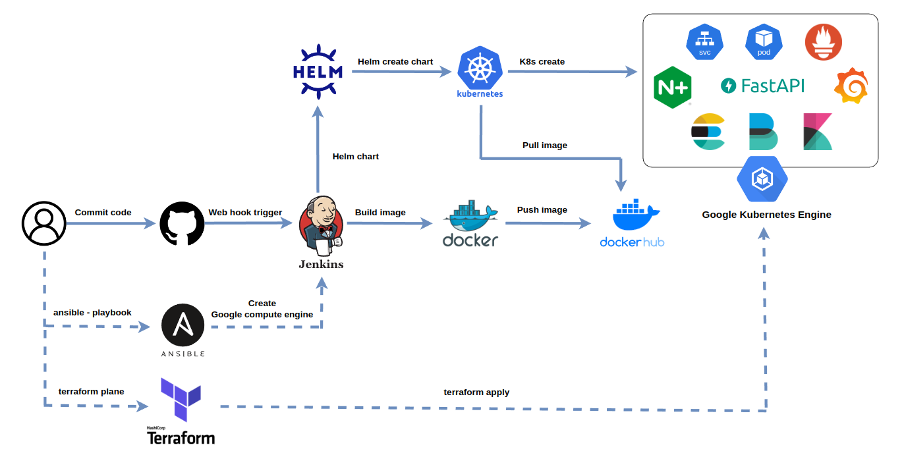
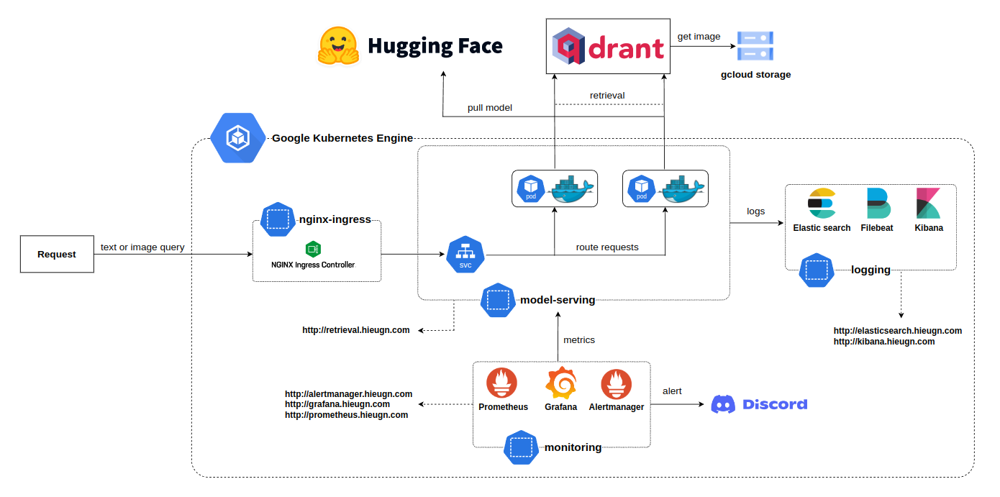

# CI/CD Pipeline To Deploy Text - Image Retrieval

## System Pipeline:

* Source control: Git/Github
* CI/CD: Jenkins
* Model: Huggingface
* Build API: FastAPI
* Containerize application: Docker
* Container orchestration system: Kubernetes/K8S
* K8s's package manager: Helm
* Monitoring tool: Prometheus & Grafana
* Logging: Elasticsearch, Filebeat, Kibana
* Deliver infrastructure as code: Ansible & Terraform
* Ingress controller: Nginx ingress
* Cloud platform: Google cloud platform/GCP

## Flow of application:

## Kubernetes architecture:

## TODOs
- Using celery for asynchronous tasks
